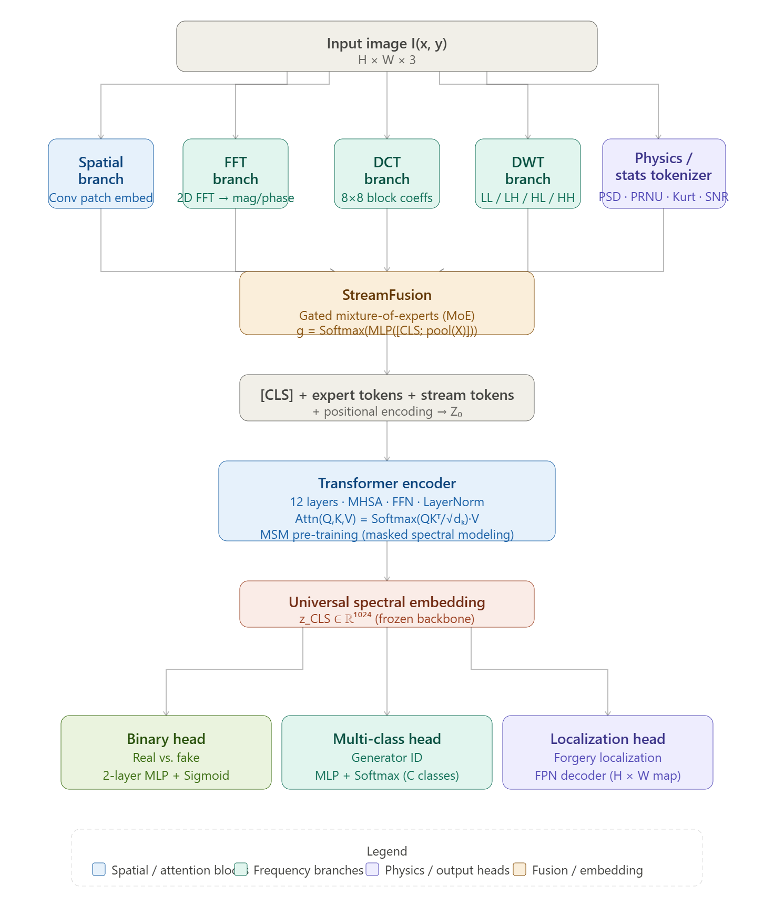
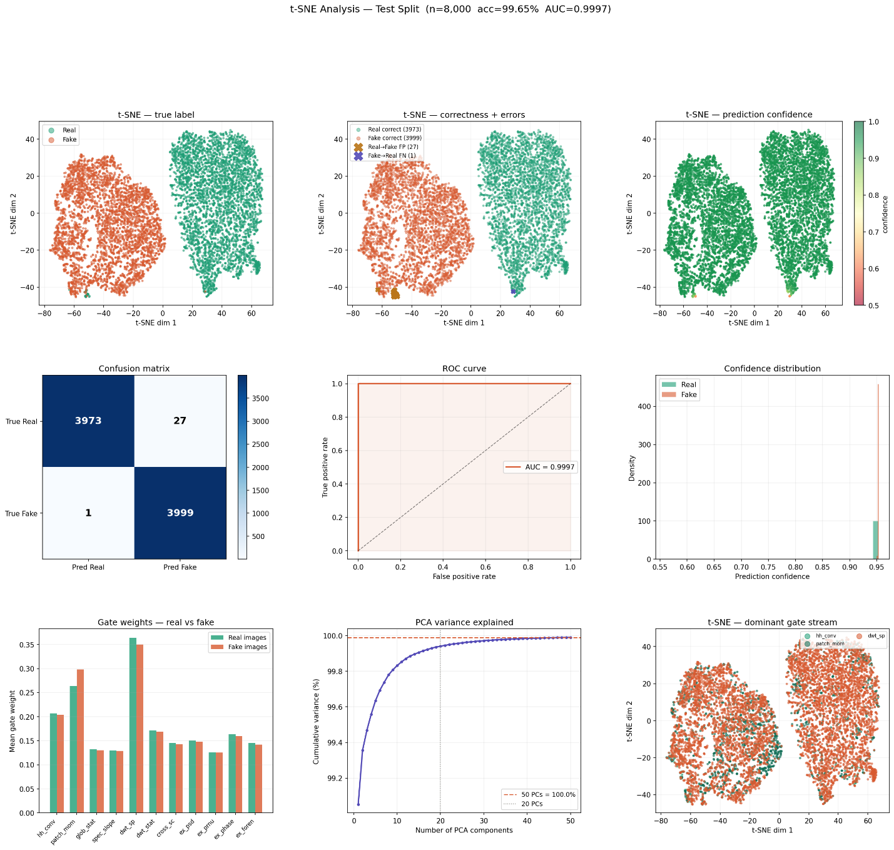
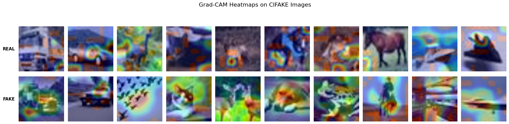

# MSST: Multi-Stream Spectral Transformer for Universal Synthetic/ AI Generated Image Detection

Most synthetic-image detectors chase the wrong target: they learn to spot *visible* failures of a particular generator — extra fingers, warped text, asymmetric eyes — and lose all power the mom[...]

[](#)
[](#license)
[](#)
[](#)

---

## What is New

| Prior work | MSST |
|---|---|
| Single-domain detectors (spatial CNN, or FFT-only, or DWT-only) | First architecture to unify spatial, FFT, DCT, DWT, **and** sensor-physics streams in one model |
| Fixed, hand-tuned fusion of features | Learned **gated Mixture-of-Experts** fusion that adapts stream weighting per input, per generator family |
| Supervised training only, no transferable backbone | **Masked Spectral Modeling (MSM)**: self-supervised pre-training on spectral tokens, label-free, MAE-style |
| One task per model (usually binary) | One frozen backbone, three swappable heads: binary detection, generator identification, forgery localization |
| Black-box predictions | Grad-CAM + LLM-assisted natural-language explanations of *why* a region was flagged |

## Architecture

The image is routed through five parallel domain-specific branches, fused by a gated MoE module, encoded by a 12-layer Transformer, and projected to a universal embedding that feeds three lightwei[...]



**Pipeline at a glance:**

1. **Spatial branch** — standard ViT-style patch embedding.
2. **FFT branch** — log-magnitude + phase spectrum, tokenized.
3. **DCT branch** — 8×8 block-wise coefficients (JPEG-aligned).
4. **DWT branch** — Haar wavelet sub-bands (LL/LH/HL/HH), with the diagnostic HH band up-weighted by a learnable scalar.
5. **Physics/Statistics tokenizer** — deterministic per-patch PSD slope, PRNU correlation, kurtosis/skewness, SNR, and cutoff frequency.

A gating network scores each stream's relevance per image, rescales the token streams accordingly, and a 12-layer Transformer encoder fuses everything into a 1024-d **Universal Spectral Embedding**, w[...]

- **Binary head** — real vs. fake
- **Multi-class head** — generator family identification (StyleGAN2/3, ProGAN, SD 1.5/XL, DALL-E 3, Midjourney, real)
- **Localization head** — pixel-level forgery mask via an FPN decoder

The backbone is pre-trained with **Masked Spectral Modeling**: 50% of tokens across all five streams are randomly masked and reconstructed, teaching the model the joint statistics of frequency, se[...]

## Key Results

| Configuration | Accuracy | Δ vs. Full | Δ vs. Spatial ViT |
|---|---|---|---|
| **Full model (MSST)** | **99.89%** | — | — |
| Spectral streams only (no ViT) | 99.16% | −0.72% | +47.88% |
| No gating (uniform stream weights) | 94.30% | −5.59% | +43.01% |
| No multi-scale DWT (P2) | 56.36% | −43.52% | +5.08% |
| Spatial ViT only (baseline) | 51.29% | −48.60% | baseline |

*Evaluated on an 8,000-image held-out CIFAKE validation subset.*

The single most important finding: a **spatial ViT trained on the same data performs at statistical chance (51.29%)**, while the spectral streams alone reach 99.16% — direct evidence that invisi[...]

## Representation Quality

t-SNE projection of the CLS embedding on 8,000 CIFAKE test images shows large-margin, near-perfectly separated clusters (AUC = 0.9997), with the 28 total errors confined to the cluster boundary:



## Explainability

Grad-CAM activations confirm the model is exploiting genuine frequency artifacts rather than semantic shortcuts: real images show activation spread diffusely across the frame (consistent with whol[...]



## Datasets

| Dataset | Scale | Use |
|---|---|---|
| [CIFAKE](https://www.kaggle.com/datasets/birdy654/cifake-real-and-ai-generated-synthetic-images) | 120K images, CIFAR-10 vs. Stable Diffusion v1.4 | Primary benchmark |
| [CNNSpot](https://github.com/PeterWang512/CNNDetection) | ~720K images, 20 GAN families | Cross-generator generalization |
| [FaceForensics++](https://github.com/ondyari/FaceForensics) | 6,000 video sequences, 5 manipulation types | Face-forgery / localization |

# Project Structure
```
deepfake-detection/
├── src/
│   ├── models/
│   │   ├── msst.py          # Full MSST model
│   │   ├── components.py    # DWT, gating, stream modules
│   │   └── heads.py         # Swappable task heads
│   ├── data/
│   │   ├── dataset.py       # DeepfakeDataset
│   │   └── extractor.py     # ExpertPhysicsExtractor (52 features)
│   └── utils/
│       └── scaler.py        # StandardScaler fitting
├── configs/
│   └── default.yaml         # Training hyperparameters
├── scripts/
│   └── train.py             # Training entry point
├── notebooks/               # Jupyter notebooks
├── checkpoints/             # Saved models (git-ignored)
├── results/                 # Plots and logs (git-ignored)
├── requirements.txt
└── README.md
```

[](https://www.youtube.com/watch?v=qfQqbIMZBVs)

## Getting Started

```bash
git clone https://github.com/Tanvir-13EEE/A-Novel-Multi-Stream-Spectral-Transformer.git
cd A-Novel-Multi-Stream-Spectral-Transformer
pip install -r requirements.txt
```

### Pre-train the backbone (Masked Spectral Modeling)

```bash
python pretrain/train_msm.py --config configs/msm_pretrain.yaml
```

### Fine-tune a detection head

```bash
python train/finetune.py --task binary --dataset cifake --checkpoint checkpoints/msm_backbone.pt
```

### Run inference

```bash
python infer.py --image path/to/image.png --checkpoint checkpoints/msst_binary.pt
```

## Citation

```bibtex
@article{prince2026msst,
  title   = {Visible Artifacts Are Not the Only Clues That Can Help Detect Fakes:
             A Multi-Stream Spectral Transformer for Universal Synthetic Image Detection},
  author  = {Mahmud Prince, Md Tanvir},
  journal = {Dept. of ECE, Virginia Tech},
  year    = {2026}
}
```

## License

This project is released under the MIT License. See [LICENSE](LICENSE) for details.

## Contact

Md Tanvir Mahmud Prince — Dept. of ECE, Virginia Tech — tanvir@vt.edu
